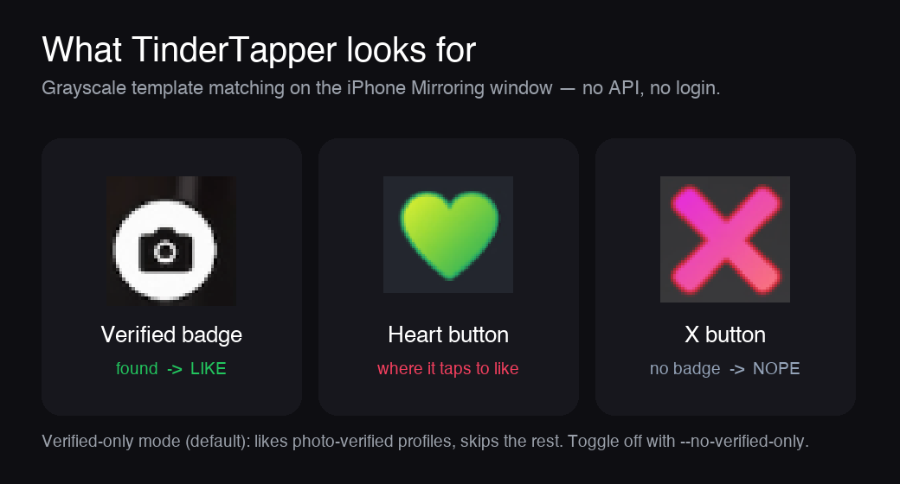
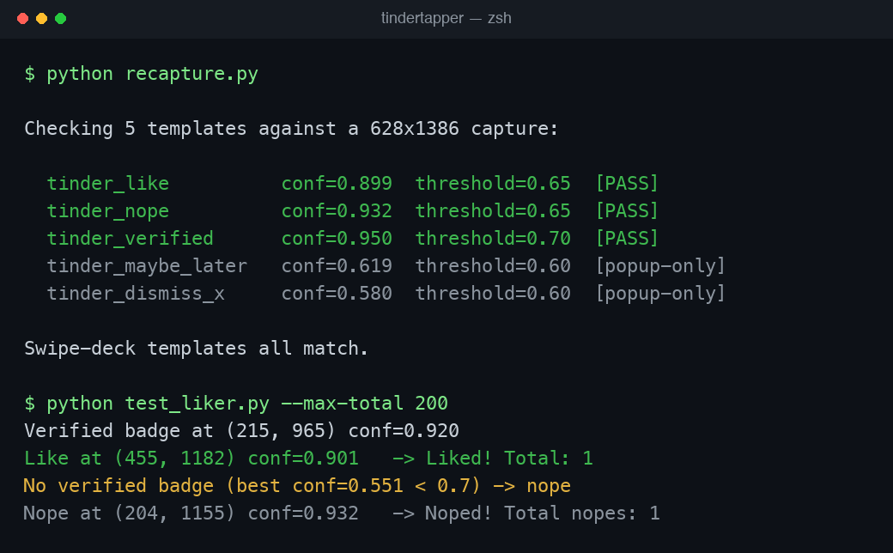

# TinderTapper

**Auto-liker for Tinder, driven through macOS [iPhone Mirroring](https://support.apple.com/en-us/120421).**

TinderTapper watches the mirrored iPhone window, finds Tinder's buttons by
image matching, and taps them for you. No API, no login, no jailbreak — it just
looks at the screen and clicks, the same way you would. By default it runs in
**verified-only mode**: it likes photo-verified profiles and skips everyone
else.



> [!WARNING]
> **Use at your own risk.** Automating Tinder violates its
> [Terms of Service](https://policies.tinder.com/terms) and can get your
> account banned. This project is for education and personal experimentation
> with screen automation. You are responsible for how you use it. No warranty.

---

## Requirements

- **macOS 15 (Sequoia) or newer** — iPhone Mirroring is required.
- An **iPhone** (iOS 18+) paired for iPhone Mirroring, with **Tinder** installed.
- **Python 3.10+**.
- Permissions: **Screen Recording** and **Accessibility** (see below).

## Install

```bash
git clone https://github.com/saltxd/tindertapper.git
cd tindertapper

python3 -m venv .venv
source .venv/bin/activate
pip install -r requirements.txt
```

### Grant macOS permissions (one-time)

The tool needs to *see* the screen and *send* clicks. Grant both to whatever
runs Python (your terminal app — Terminal, iTerm, VS Code, etc.):

1. **System Settings → Privacy & Security → Screen Recording** → enable your terminal.
2. **System Settings → Privacy & Security → Accessibility** → enable your terminal.
3. Quit and reopen the terminal after granting.

## Run it

1. Open **iPhone Mirroring** and launch **Tinder** on the swipe deck.
2. Then:

```bash
source .venv/bin/activate          # if not already active
python test_liker.py --max-total 200
```

That's it — set the cap, walk away. It likes verified profiles, nopes the rest,
and stops at the cap.



### Options

| Flag | Default | Description |
|------|---------|-------------|
| `--max-total N` | `0` (no cap) | Stop after **N** profiles (likes + nopes). Best knob for a hands-off run. |
| `--max-likes N` | `10` | Stop after **N** likes. (Overridden by `--max-total` when that's set.) |
| `--max-nopes N` | `200` | Safety cap on nopes so it can't loop forever on an all-unverified deck. |
| `--verified-only` / `--no-verified-only` | on | Like only photo-verified profiles, or like everyone. |

```bash
# Like everyone (not just verified), 50 profiles
python test_liker.py --no-verified-only --max-total 50

# Just verified, up to 500 profiles
python test_liker.py --max-total 500
```

It also auto-stops after 5 consecutive failures (e.g. the deck ran out or the
window was lost).

## How it works

1. Finds the **iPhone Mirroring** window (by exact app owner name) and captures it.
2. Locates the **heart** button to confirm it's on a swipe screen.
3. In verified-only mode, looks for the **photo-verified badge** next to the name.
   - Badge found → tap the heart (**like**).
   - No badge → tap the **X** (**nope**).
4. Clicks with a small random offset and waits a randomized delay before the next profile.
5. Dismisses Tinder's promo popups ("Double Date" etc.) via the *Maybe later* / *X* templates.

Matching is grayscale `TM_CCOEFF_NORMED`, which is robust to colour changes (a
red vs. green heart still matches) but **not** to a restyle or light/dark flip —
which is exactly what the maintenance tool below is for.

## 🔧 When Tinder changes an icon

Tinder restyles its buttons from time to time. When that happens the bot may
start misbehaving (e.g. noping everyone because the verified badge no longer
matches). `recapture.py` lets you fix it in under a minute — no code changes.

```bash
# 1. Open Tinder on the swipe deck, then see which template is failing:
python recapture.py
#   ...
#   tinder_verified   conf=0.61  threshold=0.70  [FAIL]   <- broken

# 2. Re-capture it: a window opens — drag a box around the icon, press ENTER.
python recapture.py tinder_verified

# 3. It re-checks automatically. Once it PASSes, commit & push:
git add resources/tinder_verified.png
git commit -m "Update verified badge for Tinder's new icon"
git push
```

No display / prefer not to drag a box? Crop by pixel coordinates instead:

```bash
python recapture.py tinder_verified --box 242 923 41 41
```

Run `python recapture.py --list` to see every template name.

## Templates

Stored in `resources/`. These are tiny crops of Tinder's UI; if Tinder changes
one, re-capture it with `recapture.py`.

| Template | What it is | Match threshold |
|----------|------------|-----------------|
| `tinder_like.png` | Heart / like button | 0.65 |
| `tinder_nope.png` | X / nope button | 0.65 |
| `tinder_verified.png` | Photo-verified badge by the name | 0.70 |
| `tinder_maybe_later.png` | "Maybe later" on promo popups | 0.60 |
| `tinder_dismiss_x.png` | X to close a popup | 0.60 |

## Optional: build a macOS .app

There's also an experimental Tkinter GUI (`tinder_gui.py`) with speed and
stop-limit controls. Run it directly:

```bash
python tinder_gui.py
```

…or bundle it into a clickable app with [PyInstaller](https://pyinstaller.org/):

```bash
./build.sh
cp -r dist/TinderTapper.app /Applications/
```

> The GUI is less battle-tested than the CLI and does not yet have verified-only
> mode — the CLI (`test_liker.py`) is the recommended path.

## Troubleshooting

| Symptom | Fix |
|---------|-----|
| `iPhone Mirroring window not found` | Open the iPhone Mirroring app first; make sure it's not minimized. |
| Capture returns nothing / black | Grant **Screen Recording**, then restart your terminal. |
| Clicks land but nothing happens | Grant **Accessibility**, then restart your terminal. |
| Nopes *everyone* | A template is stale — run `python recapture.py` to find the failing one, then re-capture it. |
| Likes everyone / wrong taps | Same: run `python recapture.py` and re-capture the broken template. |

## License

[MIT](LICENSE) © 2026 saltxd. Tinder is a trademark of Match Group, LLC. This
project is not affiliated with or endorsed by Tinder.
